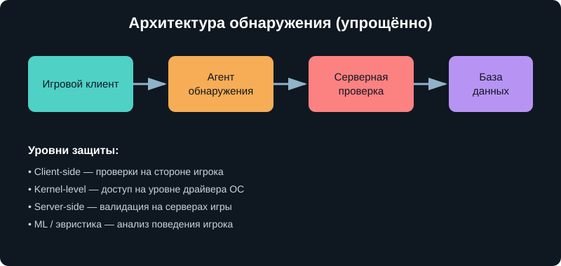
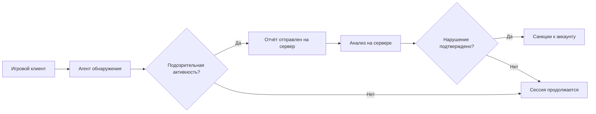
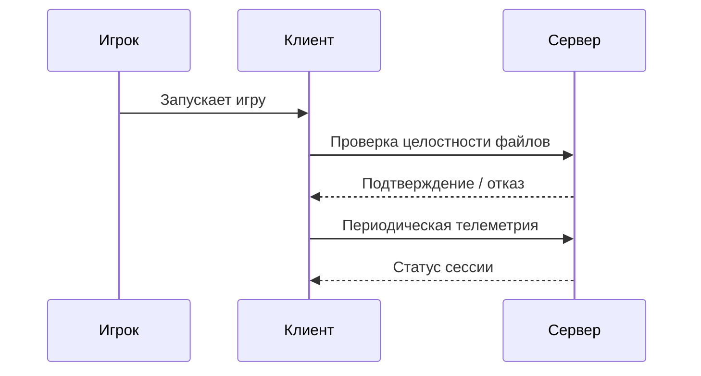
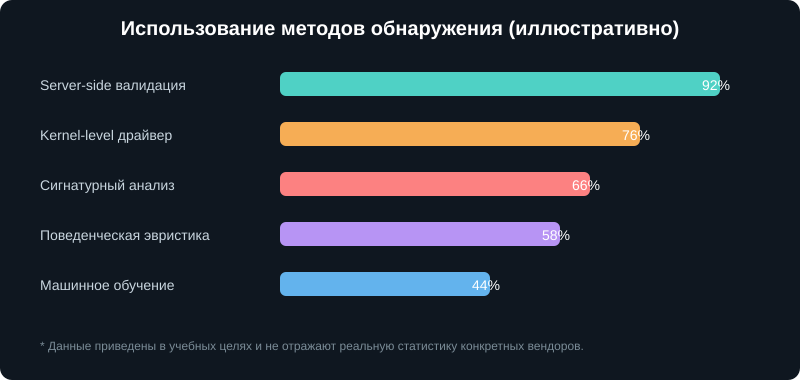

<p align="center">
  
</p>

<p align="center">

<h1 align="center">🛡️ AntiCheat Guide</h1>
<p align="center"><i>Обзор принципов работы современных античит-систем в играх</i></p>

---

## 📌 Навигация по проекту

**Разделы этого документа:**

- [О проекте](#-о-проекте)
- [Оглавление](#-оглавление)
- [Что такое античит](#-что-такое-античит)
- [Архитектура обнаружения](#-архитектура-обнаружения)
- [Сравнение подходов](#-сравнение-подходов)
- [Пример кода](#-пример-кода)
- [Документы проекта](#-документы-проекта)
- [Дорожная карта](#-дорожная-карта)
- [FAQ и цитаты](#-faq-и-цитаты)

**Файлы и папки репозитория:**

- 📁 [`src/`](src/) — демонстрационный код на Java
- 📚 [`resources/`](resources/) — документация и изображения

**Полезные внешние ссылки:**

- [Valve Anti-Cheat — статья на Wikipedia](https://en.wikipedia.org/wiki/Valve_Anti-Cheat)
- [Easy Anti-Cheat — официальный сайт](https://www.easy.ac/)
- [BattlEye — официальный сайт](https://www.battleye.com/)

---

## 📖 Оглавление

Быстрые ссылки-якоря по разделам документа:

1. [О проекте](#-о-проекте)
2. [Что такое античит](#-что-такое-античит)
3. [Архитектура обнаружения](#-архитектура-обнаружения)
4. [Сравнение подходов](#-сравнение-подходов)
5. [Пример кода](#-пример-кода)
6. [Документы проекта](#-документы-проекта)
7. [Дорожная карта](#-дорожная-карта)
8. [FAQ и цитаты](#-faq-и-цитаты)

---

## 🧩 О проекте

**AntiCheat Guide** — это *учебный* проект, который простым языком объясняет,
как устроены современные системы защиты от читеров в видеоиграх. Мы
разбираем ~~сложные~~ на самом деле вполне логичные принципы: от
`сигнатурного анализа` до серверной валидации — и показываем это на простых
диаграммах и псевдокоде. ***Важно понимать***: это не руководство по обходу
защиты, а материал для изучения контроля версий и Markdown.

> 💡 Все примеры кода в проекте — концептуальные учебные заготовки

---

## 🎮 Что такое античит?

Античит (anti-cheat) — программный комплекс, который следит за честностью
игрового процесса: не подключены ли сторонние программы, не изменена ли
память игры, не выполняются ли действия, физически невозможные для человека.

### Основные типы защиты

- **Client-side** — проверки выполняются на компьютере игрока
- **Kernel-level** — модуль работает на уровне драйвера операционной системы
- **Server-side** — анализ данных происходит на серверах разработчика
- **ML / эвристика** — поиск подозрительных паттернов поведения

---

## 🏗 Архитектура обнаружения

<p align="center">
  
</p>



Дополнительно — последовательность проверки при запуске игры:



Подробнее — в документе [architecture.md](resources/docs/architecture.md).

---

## ⚖️ Сравнение подходов

<p align="center">
  
</p>

Кратко о плюсах и минусах:

- **Client-side** — быстро, но проще всего скомпрометировать
- **Kernel-level** — глубокая видимость, но вопросы приватности
- **Server-side** — сложно обойти, но есть задержка реакции
- **ML / эвристика** — ловит новое, но возможны ложные срабатывания

Полная таблица сравнения — в документе [comparison.md](resources/docs/comparison.md).

---

## 💻 Пример кода

Фрагмент из [`src/Detector.java`](src/Detector.java) — основного класса
демонстрационного движка проверки:

```java
public DetectionResult scan(GameState state) {
    for (Rule rule : rules) {
        if (rule.isViolated(state)) {
            log.add("Нарушение правила: " + rule.getName());
            return DetectionResult.suspicious(rule.getName());
        }
    }
    return DetectionResult.clean();
}
```

---

## 📂 Документы проекта

Все документы, созданные в рамках проекта, по папкам:


1. [`src/SignatureScanner.java`](src/SignatureScanner.java) — учебный сигнатурный сканер
2. [`resources/docs/architecture.md`](resources/docs/architecture.md) — подробности архитектуры
3. [`resources/docs/comparison.md`](resources/docs/comparison.md) — таблица сравнения подходов
4. [`resources/docs/faq.md`](resources/docs/faq.md) — часто задаваемые вопросы

---

## 🗺 Дорожная карта

- [x] Составить структуру проекта
- [x] Написать основной README.md
- [x] Добавить диаграммы Mermaid
---

## ❓ FAQ и цитаты

> «Честная игра начинается с уважения к другим игрокам» — народная мудрость геймдева

> «Лучшая защита — это защита, о которой читер узнаёт последним»

Ответы на частые вопросы — в документе [faq.md](resources/docs/faq.md). Среди них:
зачем нужен доступ на уровне драйвера, почему случаются ложные срабатывания
и является ли этот проект инструкцией по обходу защиты (нет, не является).

---

<p align="center">Сделано с ❤️ в рамках самостоятельной работы по Git и Markdown</p>
