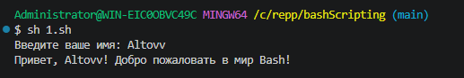
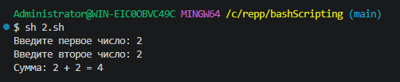
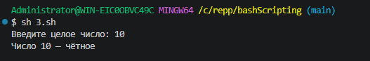
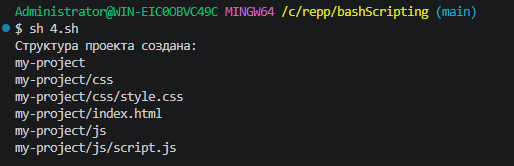
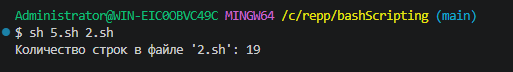
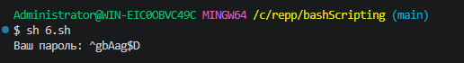
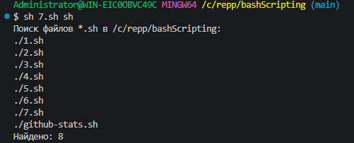
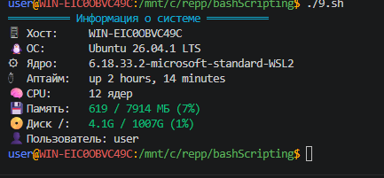
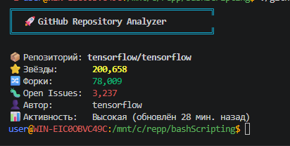

# Самостоятельная работа по Bash-программированию

## Скрипты

| Файл | Задание | Запуск |
|------|---------|--------|
| `1.sh` | Приветствие по имени пользователя | `sh 1.sh` |
| `2.sh` | Калькулятор суммы двух чисел | `sh 2.sh` |
| `3.sh` | Проверка чётности числа | `sh 3.sh` |
| `4.sh` | Создание структуры веб-проекта | `sh 4.sh [имя]` |
| `5.sh` | Подсчёт строк в файле | `sh 5.sh файл` |
| `6.sh` | Генератор пароля (8 символов) | `sh 6.sh` |
| `7.sh` | Поиск файлов по расширению | `sh 7.sh sh` |
| `8.sh` | Бонус: игра «Угадай число» | `bash 8.sh` |
| `9.sh` | Бонус: информация о системе (цветной вывод) | `bash 9.sh` |
| `github-stats.sh` | Статистика репозитория GitHub (цветной вывод) | `./github-stats.sh tensorflow/tensorflow` |

## Запуск

Скрипты 1–7 запускаются в **Git-Bash** (в PowerShell не работают):

```bash
cd bashScripting
sh 1.sh
```

`github-stats.sh` запускается в **Ubuntu WSL**. Нужны `curl` и `jq`:

```bash
sudo apt update && sudo apt install -y curl jq
chmod +x github-stats.sh
./github-stats.sh tensorflow/tensorflow
```

## Что умеют скрипты

- Проверяют ввод: нечисловые значения, пустые строки, несуществующие файлы.
- Сообщения об ошибках выводятся в `stderr`, код возврата `1`.
- `github-stats.sh` использует публичный GitHub API:
  - звёзды — жёлтые, форки — зелёные, issues — красные (> 100) или жёлтые;
  - проверяет наличие `curl` и `jq`;
  - обрабатывает неверный репозиторий (404), лимит запросов (403/429) и отсутствие сети.

## Скриншоты









- GitHub Stats:


