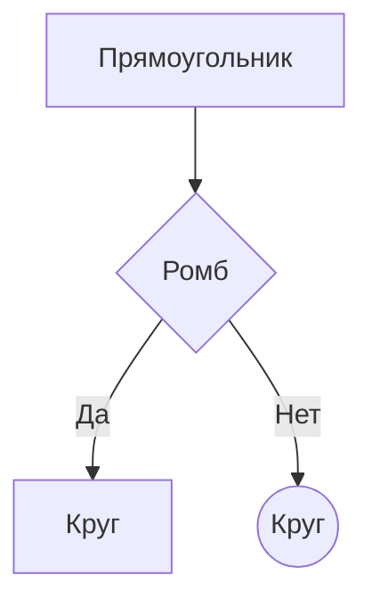
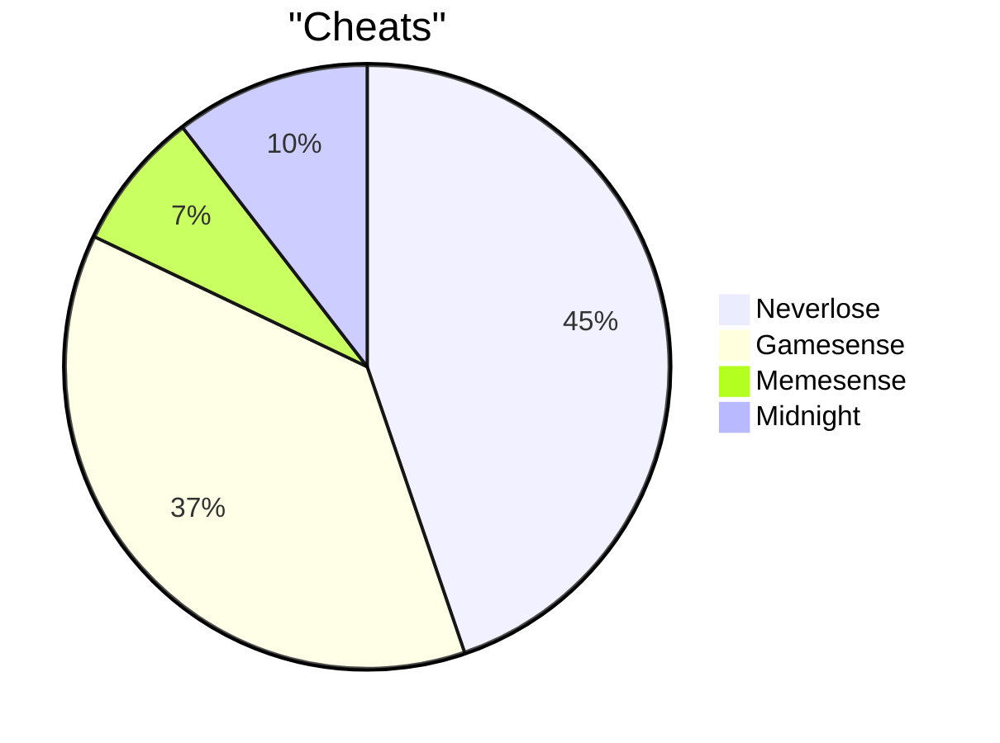

## Mermaid

**Mermaid** - специальный язык для построения диаграмм, блок схем и графиков.

#### Блок-схема

- `TD` - направление сверху-вниз
- `-->` - стрелка связи
- `|Текст|` - подпись стрелки
- `{Text}` - ромб (условие)

### Круговая диаграмма

