## Mermaid: примеры диаграмм
 
Короткие универсальные примеры основных типов диаграмм Mermaid.
---
 
#### 1. Блок-схема (flowchart)
 
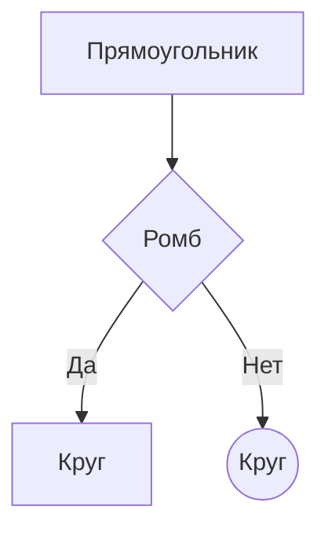
 
#### 2. Блок-схема с подграфами
 
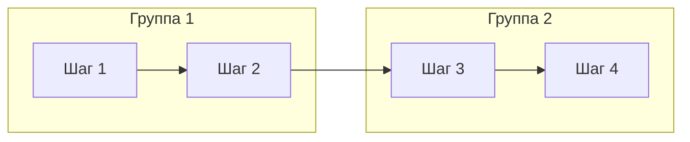
 
#### 3. Формы узлов
 
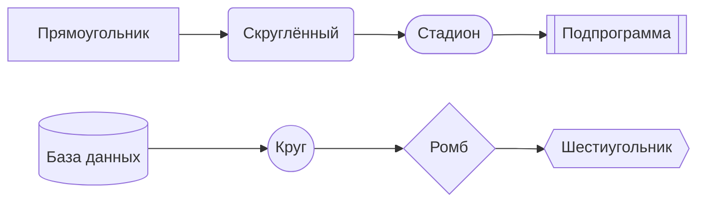
 
#### 4. Диаграмма последовательности (sequenceDiagram)
 
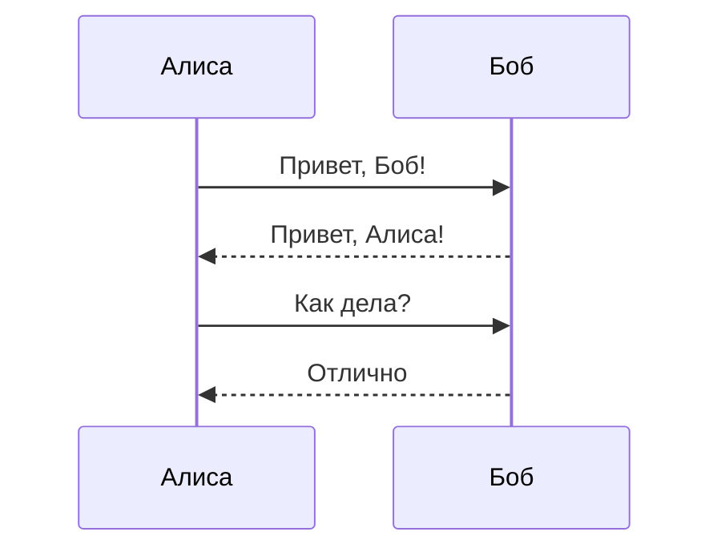
 
#### 5. Диаграмма классов (classDiagram)
 
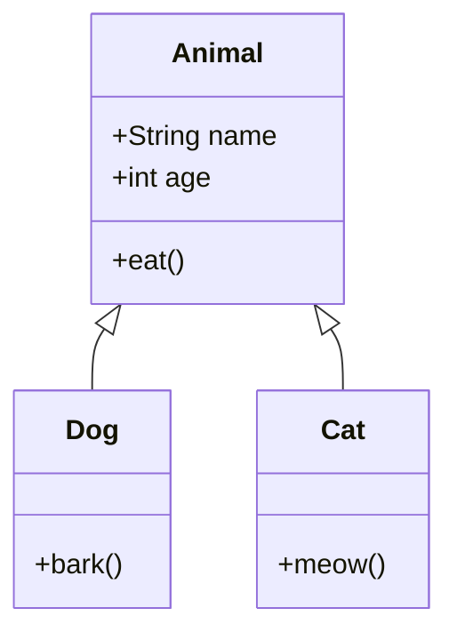
 
#### 6. Диаграмма состояний (stateDiagram)
 
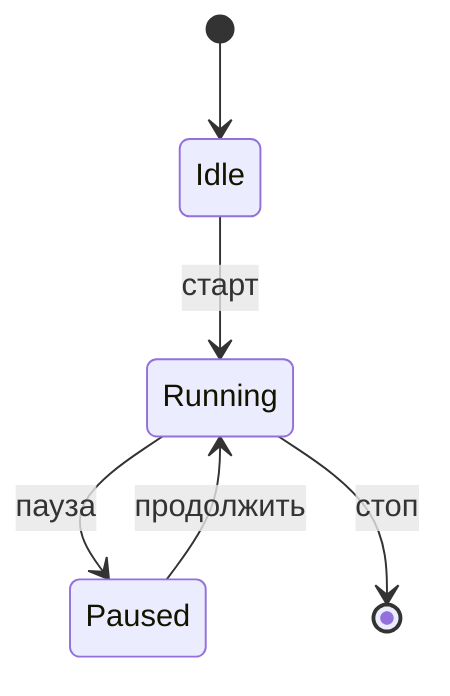
 
#### 7. ER-диаграмма (erDiagram)
 
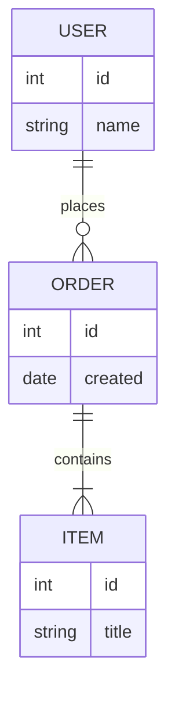
 
#### 8. Диаграмма Ганта (gantt)
 
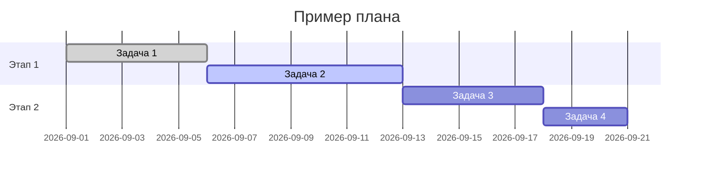
 
#### 9. Круговая диаграмма (pie)
 
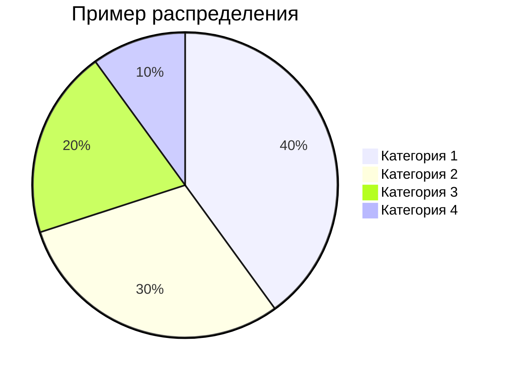
 
#### 10. Пользовательский путь (journey)
 
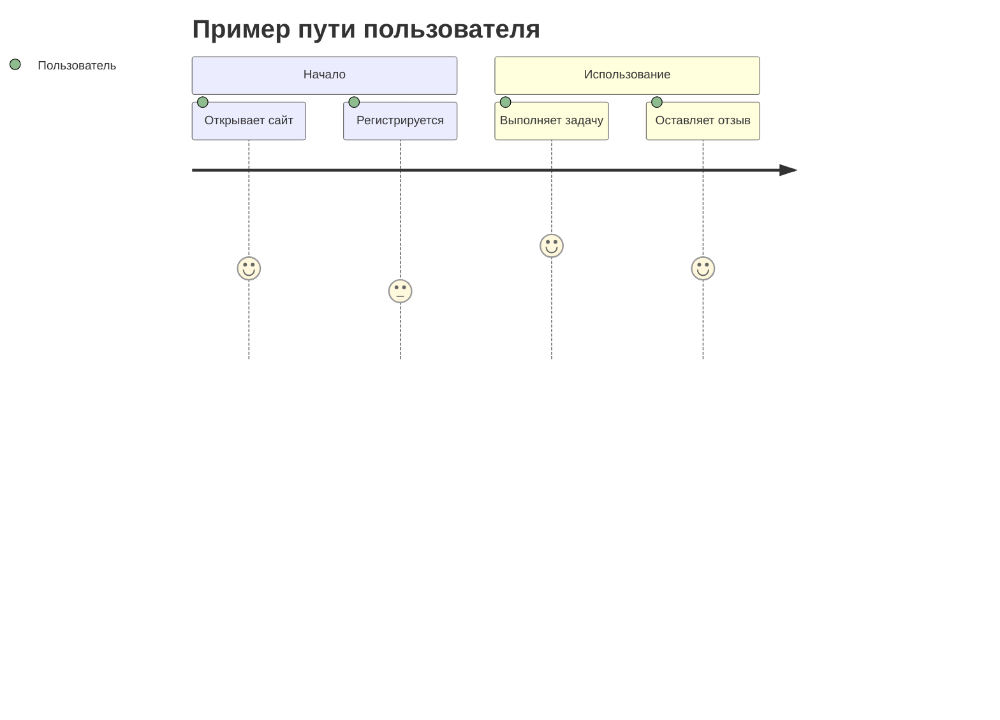
 
#### 11. Git-граф (gitGraph)
 
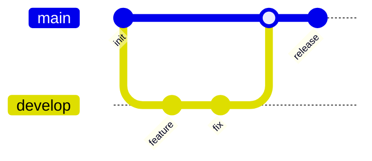
 
#### 12. Ментальная карта (mindmap)
 
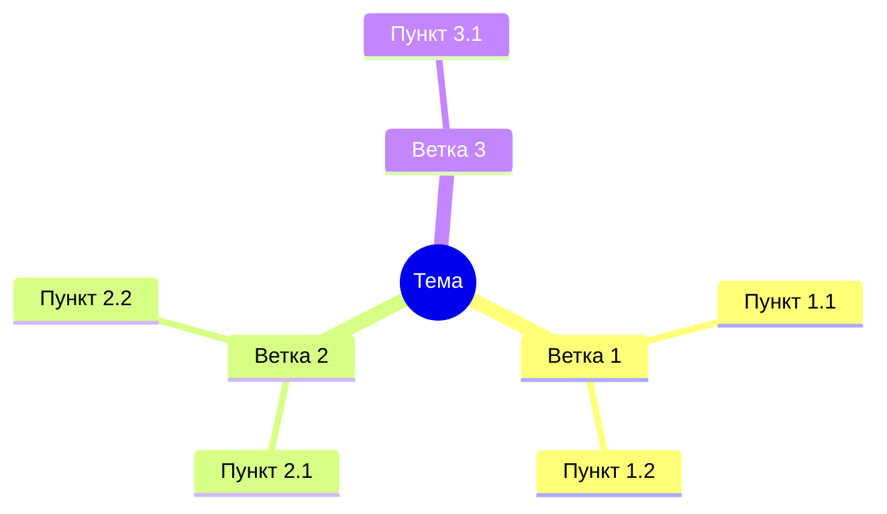
 
#### 13. Хронология (timeline)
 
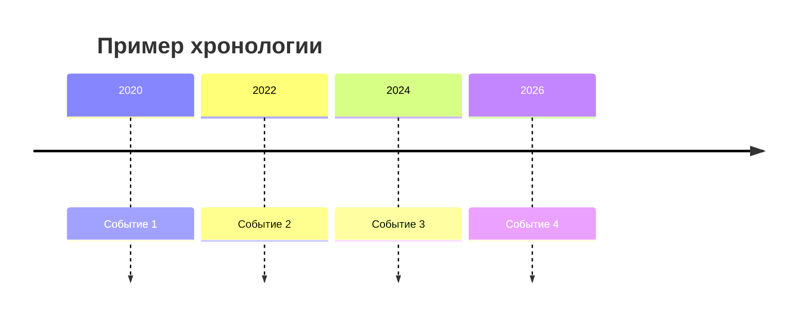